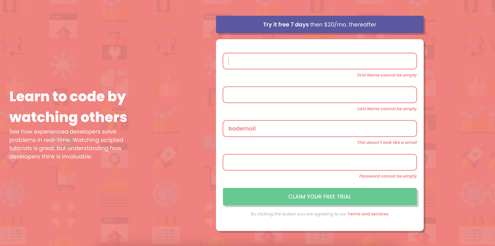
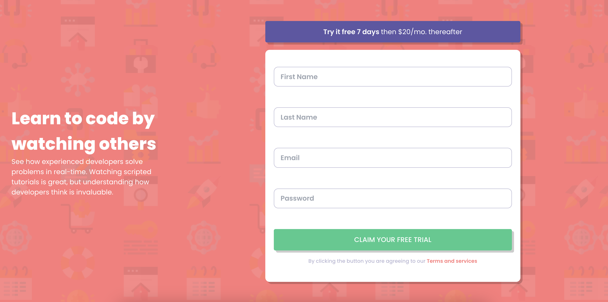

# sign-up-form

This project was bootstrapped with [Create React App](https://github.com/facebook/create-react-app).

## Available Scripts

In the project directory, you can run:

* `yarn start`
* `yarn test`
* `yarn build`
* `yarn eject`
* `yarn prettier`

### Areas of improvements

* More interactive tests using `userEvent.`
* Using the placeholder for labels creates form fields that require user recall instead of confirming.
* `useState` on `SignUpCard.tsx` could probably be reduced
* validation on the `SignUpCard.tsx` could be improved
* `CodeByWatchingInfoBox.tsx` could be centered better
* The CSS is a little bit of a mess
* Probably shouldn't of tried to use tailwind.css and should have used plain css
